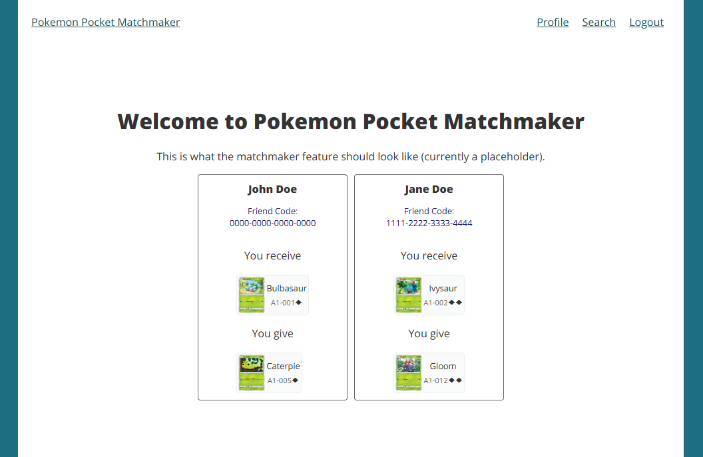
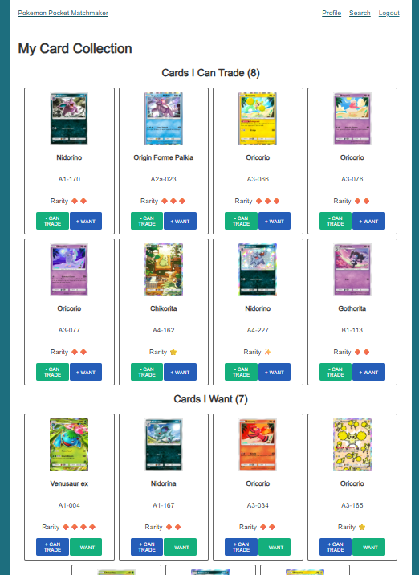
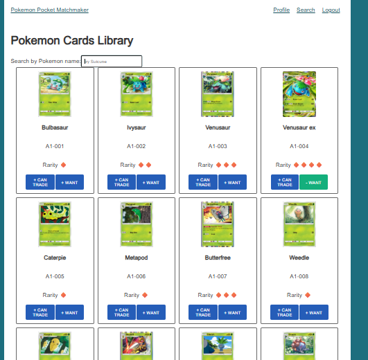

# Pokemon Pocket Trading Matchmaker

The Pokémon Pocket Trading Matchmaker is a web application designed for players of
the Pokémon TCG Pocket mobile game who actively trade and share cards with others. It’s
meant for players who want a simple and organized way to find trading partners.

## Purpose and Inspiration

The idea comes from my personal gaming experience. In Pokémon Pocket, trading can be
messy due to the limited visibility of what cards other players need or can offer. When someone
sends a trade request without listing any cards in their wish list, it’s hard to tell which cards
they’re looking for. The only way to figure it out is by checking their card dex through the share
feature, which, when available, shows the cards they haven’t yet registered in their collections.
This process helps me guess what they might want, but it takes extra steps and isn’t very
efficient. Meanwhile, Discord trading channels are often filled with unrelated messages, and
third-party apps either lack the new sharing features or overwhelm users with long ads.

This application focuses on making the trade-matching process faster and easier. Users
can list two categories of cards:

1. List cards they can trade or are willing to give up
2. List cards they want or are looking to collect

The website automatically compares these lists between users to identify possible trades. The
system then shows the potential matches on a single, simple page, including usernames, friend
codes, and the cards involved. Players can then connect in the game and complete the trade.

The main goal is not to build a complex marketplace, but a clean, minimal web app that helps Pokémon Pocket players organize their trades and find matches efficiently.

## Technology Used

-   **Next.js**
-   **React**
-   **API Routes**
-   **MongoDB**
-   **TCGdex API** (`https://api.tcgdex.net/v2/en/series/tcgp`)
    -   Card images, names, IDs, and rarity information were accessed through multiple endpoints (From series to sets, then individual cards)

### Features

-   User can register an account with a username, password, and friend code
-   Data is fetched from an external API endpoint and stored in the MongoDB database to improve performance (fetches and stores ~2000 cards locally)
-   Search and filter features can be used to search for specific cards by their name
-   User may add/remove cards to "Can Trade" and "Want" lists
-   Profile page displays the user's "Can Trade" and "Want" lists
-   Replaced card rarity in text with Emojis (Diamond 🔶, Star ⭐, Shiny ✨, Crown 👑)

### What is Incomplete

The matchmaker page currently displays static placeholder data instead of dynamically comparing users' card lists. The comparison logic that's needed to support the matchmaking feature is not complete.

## Instructions for Contributing

Create a `.env.local` file in the root directory:

```env
IRON_PASS = this_is_my_long_32_char_crazy_password
MONGODB_URI = [Your MongoDB connection string]
```

In the project's directory, install dependencies:

```env
npm i
```

Run the program:

```env
npm run dev
```

## Screenshots




